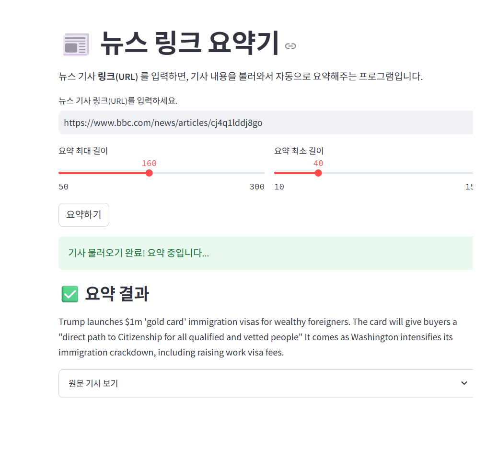

# 뉴스 요약기 (News Summarizer)

## 1. 프로젝트 개요
사용자가 뉴스 기사 본문을 입력하면, HuggingFace Transformers의 요약 모델을 이용하여
핵심 내용을 짧게 정리해 주는 웹 기반 오픈소스 소프트웨어입니다.

- 사용 언어: Python
- UI: Streamlit
- 요약 모델: facebook/bart-large-cnn (HuggingFace Transformers)

## 2. 데모 이미지 / 영상


## 3. 사용한 패키지와 버전
- Python 3.10
- transformers 4.44.0
- torch 2.x
- streamlit 1.38.0

(상세 내용은 `requirements.txt` 참고)

## 4. 설치 및 실행 방법

```bash
git clone https://github.com/jaeyeong0103/news-summarizer.git
cd news-summarizer
pip install -r requirements.txt
streamlit run app.py
